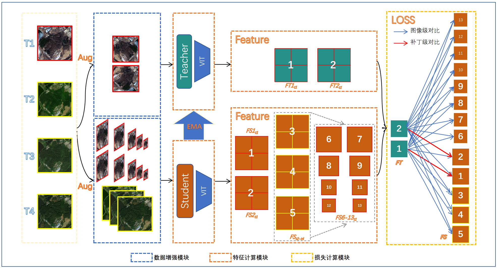
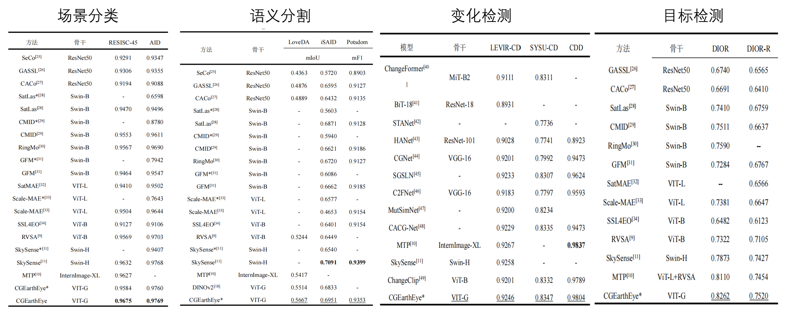
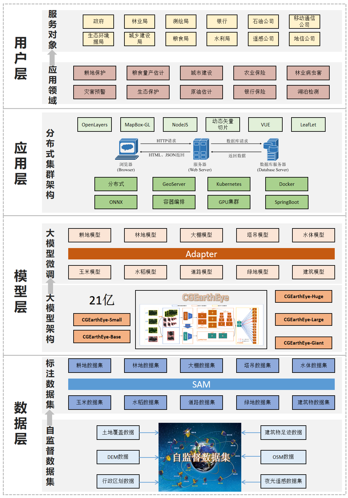

<div align="center">

#  CGEarthEye: 吉林一号大模型构建与应用

<div align="center">
  
  <br>
</div>

[\[🚀 Quick Start\]](https://www.jl1mall.com/) [\[📖 Report\]](./report) [\[📹 Weight\]](https://pan.baidu.com/s/12bds0ZTMwyRVgv7Nkq51Aw?pwd=cgwx)



## Update 🚀🚀🚀

- 2025.05.30-CGEarthEye发布吉林一号亚米级光学遥感影像预训练权重。

## 介绍

为提升吉林一号遥感卫星影像应用的智能化水平，解决视觉大模型在高分辨率卫星遥感影像上性能受限问题，我们构建了包含21亿参数量的吉林一号遥感大模型——CGEarthEye。CGEarthEye结合了生成式与对比式自监督学习算法的优势，具备对遥感影像全局与局部建模能力，并利用了全球分布的1500万高质量亚米级吉林一号卫星遥感影像样本，在16张A800 GPU上进行了训练。对比视觉领域大模型，CGEarthEye仅仅微调解码器的情况下，各项遥感任务显著优于全量微调的视觉领域大模型。对比遥感领域大模型，CGEarthEye具备大多数遥感领域大模型不具备的冻结微调能力，极大缩短应用微调时间与显存，缓解了大模型下游微调困难问题，并在4项任务10个数据集上实现冻结性能SOTA。

## [骨干](https://pan.baidu.com/s/12bds0ZTMwyRVgv7Nkq51Aw?pwd=cgwx)

|       模型       | 层数 | 编码维度 | 隐藏层维度 | 注意力头 | 参数量/M |
| :--------------: | :--: | :------: | :--------: | :------: | :------: |
| CGEarthEye-Small |  12  |   384    |    1536    |    6     |    22    |
| CGEarthEye-Base  |  12  |   768    |    3072    |    12    |    86    |
| CGEarthEye-Large |  24  |   1024   |    4096    |    16    |   307    |
| CGEarthEye-Huge  |  32  |   1280   |    5120    |    16    |   632    |
| CGEarthEye-Giant |  40  |   1536   |    6144    |    24    |   1100   |

## 测试



## 应用

在应用方面，基于CGEarthEye，我们微调了20种应用模型，已上线吉林一号网[https://www.jl1mall.com/](吉林一号网)。

<div align="center">
  
  <br>
</div>

## 微调

最后，我们为吉林一号数据集编写了训练配置，用户可根据业务快速利用CGEarthEye完成应用的迭代。

### 环境


```bash
conda create -n CGEarthEye python=3.10
conda activate CGEarthEye
pip install -r requirements.txt
```
### 数据准备

#### 场景分类

- [AID](captain-whu.github.io/AID/)
- [NWPU_RESISC45](https://gcheng-nwpu.github.io/#Datasets)

```bash
|-datasets/SceneClassification
|----AID
|    |---Airport
|        |---airport_1.jpg
|        |---airport_2.jpg
|        |---    ···
|    |---BareLand
|        |---bareland_1.jpg
|        |---    ···
|    |---  ···
|    |---train_80per.txt
|    |---val_20per.txt
|----NWPU_RESISC45
|    |---airplane
|        |---airplane_001.jpg
|        |---    ···
|    |---airport
|        |---airport_0011.jpg
|        |---    ···
|    |---  ···
|    |---train_80per.txt
|    |---val_20per.txt
...
```

#### 语义分割

#### 变化检测

#### 目标检测

### 模型训练

#### 场景分类

```bash
# 单机单卡
python tools/train_sc.py \
    config/SceneClassification/CGEarthEye-Giant-518-AID.py \
    --amp
```
```bash
# 单机多卡
python tools/dist_train_sc.sh \
    config/SceneClassification/CGEarthEye-Giant-518-AID.py
```
#### 语义分割

```bash
# 单机单卡
python inference.py \
    --checkpoint_path <path_to_the_checkpoint_you_want> \
    --image_path image_samples/IMG_CT/[IMG_CT]_016_DIOR_25156_13931_ori.png \
    --post_process_type IMG_CT \
    --prompt "Count the number of ship."
```
```bash
# 单机多卡
python inference.py \
    --checkpoint_path <path_to_the_checkpoint_you_want> \
    --image_path image_samples/IMG_CAP/[IMG_CAP]_010_RSICD_208_church_56_ori.png \
    --post_process_type IMG_CAP \
    --prompt "Describe the image."
```
#### 变化检测

```bash
# Inference for Detailed Image Caption task
python inference.py \
    --checkpoint_path <path_to_the_checkpoint_you_want> \
    --image_path image_samples/IMG_CAP_DETAILED/[IMG_CAP_DETAILED]_026_RSICD_126_commercial_5_ori.png \
    --post_process_type IMG_CAP_DETAILED \
    --prompt "Describe the image in detail."
```
```bash
# Inference for Region Classification-HBB task
python inference.py \
    --checkpoint_path <path_to_the_checkpoint_you_want> \
    --image_path image_samples/REG_CLS_HBB/[REG_CLS_HBB]_005_DIOR_3829_12264_ori.png \
    --post_process_type REG_CLS_HBB \
    --prompt "Classify the region of <box><855><297><891><355></box>.\nUse one or a few words."
```
#### 目标检测

```bash
# Inference for Region Classification-OBB task
python inference.py \
    --checkpoint_path <path_to_the_checkpoint_you_want> \
    --image_path image_samples/REG_CLS_OBB/[REG_CLS_OBB]_001_DIOR_1_11726_ori.png \
    --post_process_type REG_CLS_OBB \
    --prompt "Classify the region of <quad><703><420><703><292><571><292><571><420></quad>.\nUse one or a few words."
```
```bash
# Inference for Region Detection-HBB task
python inference.py \
    --checkpoint_path <path_to_the_checkpoint_you_want> \
    --image_path image_samples/REG_DET_HBB/[REG_DET_HBB]_004_DIOR_5212_12735_ori.png \
    --post_process_type REG_DET_HBB \
    --prompt "Detect all stadium in the image."
```

### 模型测试

#### 场景分类

```bash
# 单机单卡
python tools/test_sc.py \
    config/SceneClassification/CGEarthEye-Giant-518-AID.py
```
```bash
# 单机多卡
python tools/dist_test_sc.sh \
    config/SceneClassification/CGEarthEye-Giant-518-AID.py
```

#### 语义分割

#### 变化检测

#### 目标检测

```bash
# Inference for Region Detection-OBB task
python inference.py \
    --checkpoint_path <path_to_the_checkpoint_you_want> \
    --image_path image_samples/REG_DET_OBB/[REG_DET_OBB]_034_DOTA2.0_77716_P0799_ori.png \
    --post_process_type REG_DET_OBB \
    --prompt "Detect all harbor in the image.\nUse oriented bounding boxes."
```
```bash
# Inference for Visual Grounding task
python inference.py \
    --checkpoint_path <path_to_the_checkpoint_you_want> \
    --image_path image_samples/REG_VG/[REG_VG]_002_DIOR-RSVG_69_00258_ori.png \
    --post_process_type REG_VG \
    --prompt "Detect an area that matches the description.\nfind a swimming pool that is about 118 square meters. there is a parking lot that is about 2988 square meters, located approximately 38 meters northeast of the swimming pool.\nUse horizontal bounding boxes."
```
```bash
# Inference for Region Caption task
python inference.py \
    --checkpoint_path <path_to_the_checkpoint_you_want> \
    --image_path image_samples/REG_CAP/[REG_CAP]_001_DIOR-RSVG_1_00006_ori.png \
    --post_process_type REG_CAP \
    --prompt "Describe the <box><622><706><696><831></box> in this image."
```
```bash
# Inference for Pixel Classification task
python inference.py \
    --checkpoint_path <path_to_the_checkpoint_you_want> \
    --image_path image_samples/PIX_CLS/[PIX_CLS]_039_GEONRW_74671_427_5725_rgb_ori.png \
    --post_process_type PIX_CLS \
    --prompt "Classify the region of <poly><1000><0><488><0><465><221><443><279><696><258><704><373><772><343><809><397><631><489><741><704><1000><682><1000><585><965><589><959><509><961><471><1000><413></poly>.\nUse one or a few words."
```
```bash
# Inference for Segmentation task
python inference.py \
    --checkpoint_path <path_to_the_checkpoint_you_want> \
    --image_path image_samples/PIX_SEG/[PIX_SEG]_034_GEONRW_376_5755_rgb-ori.png \
    --post_process_type PIX_SEG \
    --prompt "Segment out road in the image."
```
```bash
# Inference for Change Detection task
python inference.py \
    --checkpoint_path <path_to_the_checkpoint_you_want> \
    --image_path image_samples/PIX_CHG/[PIX_CHG]_199_WHU-CD_28911_590_ori.png \
    --image2_path image_samples/PIX_CHG/[PIX_CHG]_199_WHU-CD_28911_590_post.png \
    --post_process_type PIX_CHG \
    --prompt "Find changes in the two images."
```

## License

This project is released under the [MIT license](LICENSE). Parts of this project contain code and models from other sources, which are subject to their respective licenses.

## 💡 Relevant Projects

[1] <strong>Skysense: A multi-modal remote sensing foundation model towards universal interpretation for earth observation imagery, IEEE CVPR, 2024</strong> | [Paper](https://arxiv.org/abs/2312.10115) 
<br><em>&ensp; &ensp; &ensp;Xin Guo<sup>&#8727;</sup>, Jiangwei Lao<sup>&#8727;</sup>, Bo Dang, Yingying Zhang, Lei Yu,Lixiang Ru,Liheng Zhong,Ziyuan Huang,Kang Wu,Dingxiang Hu,Huimei He,Jian Wang,Jingdong Chen,Ming Yang,Yongjun Zhang and Yansheng Li</em>

[2] <strong>Mtp: Advancing remote sensing foundation model via multi-task pretraining, IEEE JSTARS, 2024</strong> | [Paper](https://arxiv.org/abs/2403.13430/) | [Github](https://github.com/ViTAE-Transformer/MTP)
<br><em>&ensp; &ensp; &ensp;Di Wang<sup>&#8727;</sup>, Jing Zhang<sup>&#8727;</sup>, Minqiang Xu<sup>&#8727;</sup>, Lin Liu, Dongsheng Wang, Erzhong Gao,Chengxi Han,Haonan Guo and Bo Du</em>

[3] <strong>DINOv2: Learning Robust Visual Features without Supervision,2024</strong> | [Paper](arxiv.org/abs/2304.07193) | [Github](github.com/facebookresearch/dinov2)
<br><em>&ensp; &ensp; &ensp;Maxime Oquab<sup>&#8727;</sup>, Timothée Darcet, Théo Moutakanni, Huy Vo, Marc Szafraniec, Vasil Khalidov, Pierre Fernandez, Daniel Haziza, Francisco Massa, Alaaeldin El-Nouby, Mahmoud Assran, Nicolas Ballas, Wojciech Galuba, Russell Howes, Po-Yao Huang, Shang-Wen Li, Ishan Misra, Michael Rabbat, Vasu Sharma, Gabriel Synnaeve, Hu Xu, Hervé Jegou, Julien Mairal, Patrick Labatut, Armand Joulin and Piotr Bojanowski</em>
