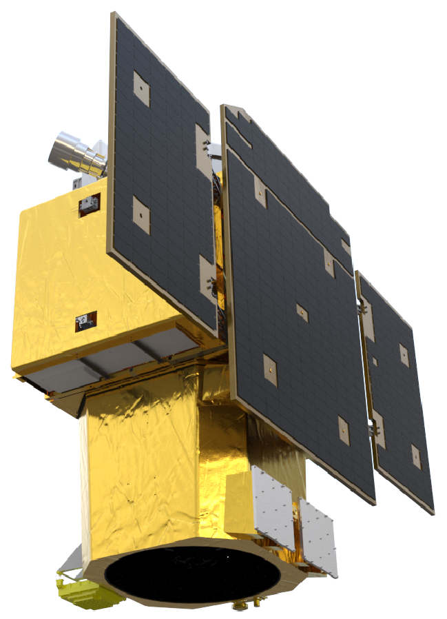
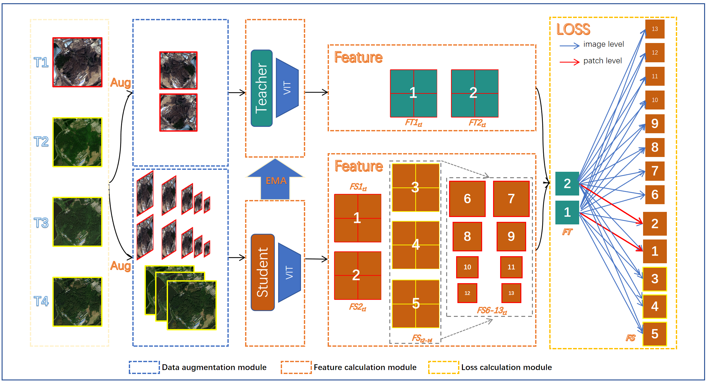
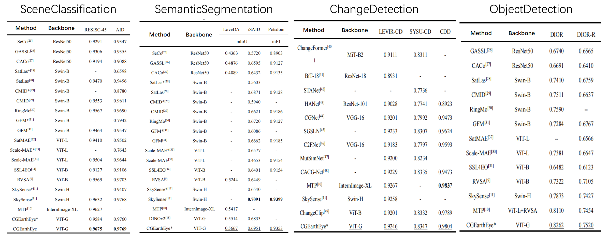
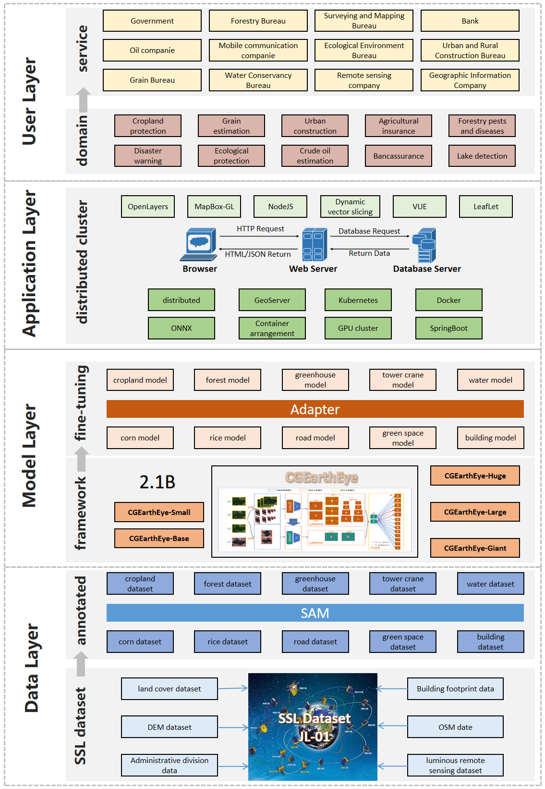

<div align="center">

#  CGEarthEye: Construction and Application of Jilin-1 Remote Sensing Foundation Model

<div align="center">
  
  <br>
</div>
[\[🚀 Quick Start\]](https://www.jl1mall.com/) [\[📖 Report\]](./report) [\[📹 Weight\]](https://pan.baidu.com/s/12bds0ZTMwyRVgv7Nkq51Aw?pwd=cgwx)[\[📖 Chinese\]](./README-ZH.md)




</div>

## Update 🚀🚀🚀

- 2025.05.30-CGEarthEye releases pre-trained weights for Jilin-1 sub-meter-level optical remote sensing imagery.

## Introduction

To enhance the intelligent application of Jilin-1 remote sensing satellite imagery and address the performance limitations of large vision models on high-resolution satellite remote sensing data, we have developed CGEarthEye—a Jilin-1 remote sensing foundation model with 2.1 billion parameters. CGEarthEye combines the strengths of generative and contrastive self-supervised learning algorithms, enabling both global and local modeling of remote sensing imagery. It leverages 15 million globally distributed, high-quality sub-meter-level Jilin-1 satellite remote sensing samples and was trained on 16 A800 GPUs.  Compared to foundation vision models,  CGEarthEye significantly outperforms fully fine-tuned vision models across various remote sensing tasks with only decoder fine-tuning. When benchmarked against existing remote sensing large models, CGEarthEye introduces freezing fine-tuning capabilities (absent in most remote sensing models),  drastically reducing fine-tuning time and GPU memory consumption. This alleviates the challenges of downstream fine-tuning for large models and achieves state-of-the-art (SOTA) frozen performance on 10 datasets across 4 tasks.

## Backbone

[Baidu](https://pan.baidu.com/s/12bds0ZTMwyRVgv7Nkq51Aw?pwd=cgwx)

|      Model       | Layer | Encoding | Hidden | Multi-head | Parameter/M |
| :--------------: | :---: | :------: | :--------: | :------: | :------: |
| CGEarthEye-Small |  12   |   384    |    1536    |    6     |    22    |
| CGEarthEye-Base  |  12   |   768    |    3072    |    12    |    86    |
| CGEarthEye-Large |  24   |   1024   |    4096    |    16    |   307    |
| CGEarthEye-Huge  |  32   |   1280   |    5120    |    16    |   632    |
| CGEarthEye-Giant |  40   |   1536   |    6144    |    24    |   1100   |

## Test



## Application

In terms of practical applications, leveraging CGEarthEye, we have fine-tuned 20 application models that are now live on the Jilin-1 Platform--[https://www.jl1mall.com/](吉林一号网)。

<div align="center">
  
  <br>
</div>


## Fine-tuning

Finally, we have prepared training configurations for the Jilin-1 dataset, enabling users to efficiently adapt CGEarthEye for rapid application iteration based on their specific business needs.

### Environment


```bash
conda create -n CGEarthEye python=3.10
conda activate CGEarthEye
pip install -r requirements.txt
```

### Data preparation

#### Scene Classification

- [AID](captain-whu.github.io/AID/)
- [NWPU_RESISC45](https://gcheng-nwpu.github.io/#Datasets)

```bash
|-datasets/SceneClassification
|----AID
|    |---Airport
|        |---airport_1.jpg
|        |---airport_2.jpg
|        |---    ···
|    |---BareLand
|        |---bareland_1.jpg
|        |---    ···
|    |---  ···
|    |---train_80per.txt
|    |---val_20per.txt
|----NWPU_RESISC45
|    |---airplane
|        |---airplane_001.jpg
|        |---    ···
|    |---airport
|        |---airport_0011.jpg
|        |---    ···
|    |---  ···
|    |---train_80per.txt
|    |---val_20per.txt
...
```

#### Semantic Segmentation

- [ISAID](https://captain-whu.github.io/iSAID/index.html)
- [cropland](http://10.200.30.48:8080/store)

```bash
|-datasets/SemanticSegmentation
|----cropland
|    |---train
|        |---Img
|            |---LC_01_000001.png
|            |---LC_01_000002.png
|            |---    ···
|        |---Label
|            |---LC_01_000001.png
|            |---LC_01_000002.png
|            |---    ···
|    |---val
|        |---Img
|            |---LC_01_000001.png
|            |---LC_01_000002.png
|            |---    ···
|        |---Label
|            |---LC_01_000001.png
|            |---LC_01_000002.png
|            |---    ···
|    |---test
|        |---Img
|            |---LC_01_000001.png
|            |---LC_01_000002.png
|            |---    ···
|        |---Label
|            |---LC_01_000001.png
|            |---LC_01_000002.png
|            |---    ···

|----ISAID
|    |---img_dir
|        |---train
|            |---P0003_0_896_0_896.png
|            |---    ···
|        |---val
|            |---P0003_0_896_0_896.png
|            |---    ···
|        |---test
|            |---P0003_0_896_0_896.png
|            |---    ···
|    |---ann_dir
|        |---train
|            |---P0003_0_896_0_896_instance_color_RGB.png
|            |---    ···
|        |---val
|            |---P0003_0_896_0_896_instance_color_RGB.png
|            |---    ···
|        |---test
|            |---P0003_0_896_0_896_instance_color_RGB.png
|            |---    ···
...
```

#### Change Detection

- [LEVIR-CD](https://opendatalab.com/OpenDataLab/LEVIR-CD)
- [SYSU-CD](https://github.com/liumency/SYSU-CD)
- [CDD](https://paperswithcode.com/dataset/cdd-dataset-season-varying)

```bash
|-datasets/ChangeDetection
|----SYSU-CD
|    |---train
|        |---Image1
|           |---00000.png
|           |---    ···
|        |---Image2
|           |---00000.png
|           |---    ···
|        |---Label
|           |---00000.png
|           |---    ···
|    |---val
|        |---Image1
|           |---00000.png
|           |---    ···
|        |---Image2
|           |---00000.png
|           |---    ···
|        |---Label
|           |---00000.png
|           |---    ···
|    |---test
|        |---Image1
|           |---00000.png
|           |---    ···
|        |---Image2
|           |---00000.png
|           |---    ···
|        |---Label
|           |---00000.png
|           |---    ···
|----LEVIR-CD
|...
|----CDD
|...
```

#### Object Detection

- [DIOR / DIOR-R](www.escience.cn/people/JunweiHan/DIOR.html)


```bash
|-datasets/ObjectDetection
|----DIOR
|    |---images
|        |---trainval/
|        |    |---00001.jpg
|        |    |---00002.jpg
|        |    |---  ...
|        |---test/
|        |    |---11726.jpg
|        |    |---11727.jpg
|        |    |---  ...
|    |---Annotations
|        |---trainval.json
|        |---test.json

|----DIOR-R
|    |---images
|        |---trainval/
|        |    |---00001.jpg
|        |    |---00002.jpg
|        |    |---  ...
|        |---test/
|        |    |---11726.jpg
|        |    |---11727.jpg
|        |    |---  ...
|    |---ImageSets
|        |---Main
|        |    |---train.txt
|        |    |---val.txt
|        |    |---test.txt
|    |---Annotations
|        |---Oriented Bounding Boxes
|        |    |---00001.xml
|        |    |---00002.xml
|        |    |---  ....
```


### Training

#### Scene Classification

```bash
# Single machine single card
python tools/train_sc.py \
    config/SceneClassification/CGEarthEye-Giant-518-AID.py \
    --amp
```

```bash
# Single machine multi card
python tools/dist_train_sc.sh \
    config/SceneClassification/CGEarthEye-Giant-518-AID.py 4
```

#### Semantic Segmentation

```bash
# Single machine single card
python ./tools/train_ss.py config/SemanticSegmentation/CGEarthEye-Giant-518-ISAID
```

```bash
# Single machine multi card
bash ./tools/dist_train_ss.sh config/SemanticSegmentation/CGEarthEye-Giant-518-ISAID 4
```

#### Change Detection

```bash
# Single machine single card
python ./tools/train_cd.py config/ChangeDetection/CGEarthEye-Giant-518-levircd.py
```

```bash
# Single machine multi card
bash ./tools/dist_train_cd.sh config/ChangeDetection/CGEarthEye-Giant-518-levircd.py 4
```

#### Object Detection

```bash
# H-Box（MMDetection3.x）
# Single machine single card
python tools/train_hbb.py config/ObjectDetection/HBB/CGEarthEye-Giant-784-DIOR.py
# Single machine multi card
CUDA_VISIBLE_DEVICES=0,1,2,3 bash tools/dist_train_hbb.sh config/ObjectDetection/HBB/CGEarthEye-Giant-784-DIOR.py 4
```

```bash
# R-Box（MMRotate1.x）
# Single machine single card
python tools/train_obb.py config/ObjectDetection/OBB/CGEarthEye-Giant-784-DIORR.py
# Single machine multi card
CUDA_VISIBLE_DEVICES=0,1,2,3 bash tools/dist_train_obb.sh config/ObjectDetection/OBB/CGEarthEye-Giant-784-DIORR.py 4
```

### Test

#### Scene Classification

```bash
# Single machine single card
python tools/test_sc.py \
    config/SceneClassification/CGEarthEye-Giant-518-AID.py
```

```bash
# Single machine multi card
python tools/dist_test_sc.sh \
    config/SceneClassification/CGEarthEye-Giant-518-AID.py 4
```

#### Semantic Segmentation

```bash
# Single machine single card
python tools/test_ss.py \
    config/SemanticSegmentation/CGEarthEye-Giant-518-ISAID.py
```

```bash
# Single machine multi card
python tools/dist_test_ss.sh \
    config/SemanticSegmentation/CGEarthEye-Giant-518-ISAID.py 4
```

#### Change Detection

```bash
# Single machine single card
python ./tools/test_cd.py config/ChangeDetection/CGEarthEye-Giant-518-levircd.py work_dir/last.pth
```

#### Object Detection

```bash
# H-Box（MMDetection3.x）
# Single machine single card
python tools/test_hbb.py \
    config/ObjectDetection/HBB/CGEarthEye-Giant-784-DIOR.py \
    Path/To/Your/Weight/hbb_model.pth
# Single machine multi card
CUDA_VISIBLE_DEVICES=0,1,2,3 bash tools/dist_test_hbb.sh \
    config/ObjectDetection/HBB/CGEarthEye-Giant-784-DIOR.py \
    Path/To/Your/Weight/hbb_model.pth 4
```

```bash
# R-Box（MMRotate1.x）
# Single machine single card
python tools/test_obb.py \
    config/ObjectDetection/OBB/CGEarthEye-Giant-784-DIORR.py \
    Path/To/Your/Weight/obb_model.pth
# Single machine multi card
CUDA_VISIBLE_DEVICES=0,1,2,3 bash tools/dist_test_obb.sh \
    config/ObjectDetection/OBB/CGEarthEye-Giant-784-DIORR.py \
    Path/To/Your/Weight/obb_model.pth 4
```

## License

This project is released under the [MIT license](LICENSE). Parts of this project contain code and models from other sources, which are subject to their respective licenses.

## 💡 Relevant Projects

[1] <strong>Skysense: A multi-modal remote sensing foundation model towards universal interpretation for earth observation imagery, IEEE CVPR, 2024</strong> | [Paper](https://arxiv.org/abs/2312.10115) 
<br><em>&ensp; &ensp; &ensp;Xin Guo<sup>&#8727;</sup>, Jiangwei Lao<sup>&#8727;</sup>, Bo Dang, Yingying Zhang, Lei Yu,Lixiang Ru,Liheng Zhong,Ziyuan Huang,Kang Wu,Dingxiang Hu,Huimei He,Jian Wang,Jingdong Chen,Ming Yang,Yongjun Zhang and Yansheng Li</em>

[2] <strong>Mtp: Advancing remote sensing foundation model via multi-task pretraining, IEEE JSTARS, 2024</strong> | [Paper](https://arxiv.org/abs/2403.13430/) | [Github](https://github.com/ViTAE-Transformer/MTP)
<br><em>&ensp; &ensp; &ensp;Di Wang<sup>&#8727;</sup>, Jing Zhang<sup>&#8727;</sup>, Minqiang Xu<sup>&#8727;</sup>, Lin Liu, Dongsheng Wang, Erzhong Gao,Chengxi Han,Haonan Guo and Bo Du</em>

[3] <strong>DINOv2: Learning Robust Visual Features without Supervision,2024</strong> | [Paper](arxiv.org/abs/2304.07193) | [Github](github.com/facebookresearch/dinov2)
<br><em>&ensp; &ensp; &ensp;Maxime Oquab<sup>&#8727;</sup>, Timothée Darcet, Théo Moutakanni, Huy Vo, Marc Szafraniec, Vasil Khalidov, Pierre Fernandez, Daniel Haziza, Francisco Massa, Alaaeldin El-Nouby, Mahmoud Assran, Nicolas Ballas, Wojciech Galuba, Russell Howes, Po-Yao Huang, Shang-Wen Li, Ishan Misra, Michael Rabbat, Vasu Sharma, Gabriel Synnaeve, Hu Xu, Hervé Jegou, Julien Mairal, Patrick Labatut, Armand Joulin and Piotr Bojanowski</em>
